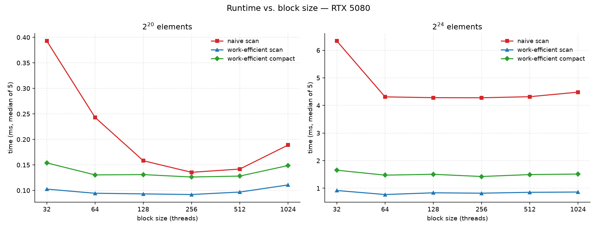
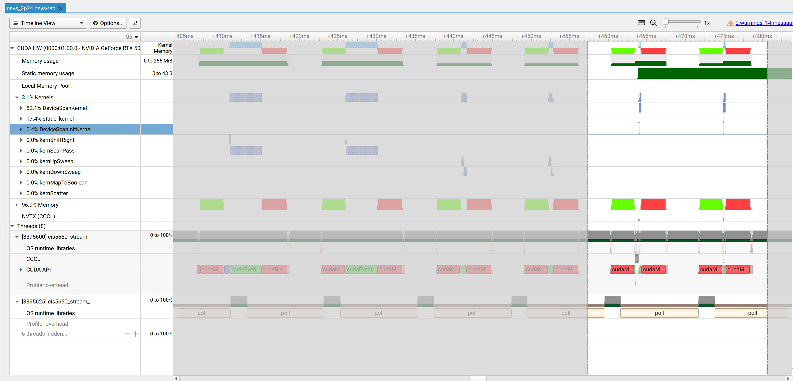
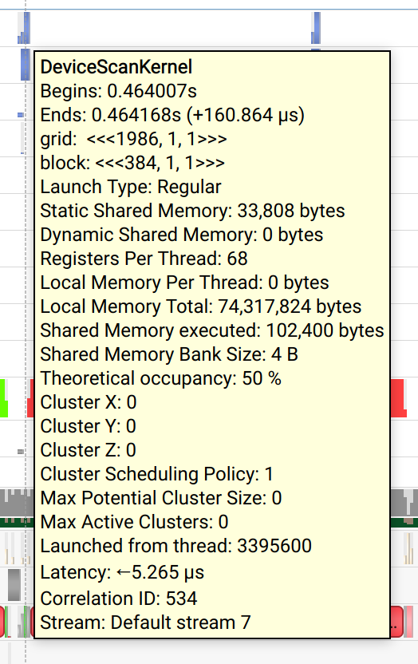
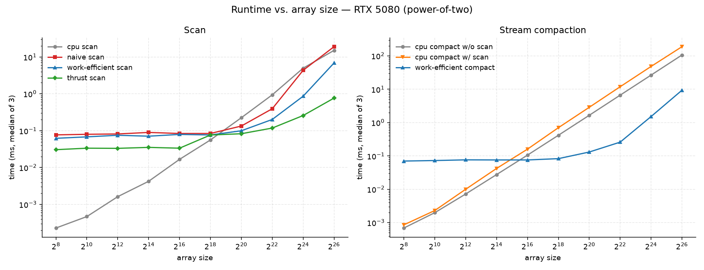

**University of Pennsylvania, CIS 5650: GPU Programming and Architecture,
Project 2 - Stream Compaction**

* Neel Shejwalkar
  * [LinkedIn](https://www.linkedin.com/in/neel-shejwalkar/), [twitter](https://x.com/neelshej)
* Tested on: Ubuntu 24.04.4 LTS, Ryzen 9 9950X @ 5.75GHz 64GB, RTX 5080 (GB203, sm_120) 16GB (Personal Computer)

| | |
|---|---|
| SMs | 84 |
| CUDA cores | 128/SM = 10752 total |
| Max threads / SM | 1536 (48 warps) |
| Max blocks / SM | 24 |
| L2 cache | 64 MB |
| Shared memory | 100 KB/SM, 48 KB/block |
| Registers | 65,536 per SM |
| Memory bus | 256-bit GDDR7 @ 15001 MHz = 960 GB/s |
| VRAM | 16384 MB |
| SM clock (max) | 3090 MHz |
| Peak FP32 | 56.3 TFLOP/s |

# Performance Analysis



After running a script to test for the optimal block size for the naive and efficient algorithms, it determined that a size of 256 and 128 threads per block probably results in the naive and efficient algorithms being decently optimized, respectively. The script ran each configuration of (block size, algorithm) 5 times and took the median runtime across these. I tested the efficient scan and compact algorithms separately to see if they largely disagreed anywhere, but this wasn't the case. In fact, block sizes of 64-512 seemed to generally be near equal in performance.

I only tested on input sizes 2^20 and 2^24 because they were on the larger end of what I was going to benchmark for - normally, you would optimize the block size for a representative input size for the specific use case, but given that these are just general algorithms, I figured that testing on a few larger sizes (where one would opt for a kernel-based solution over a cpu-based one anyway) would be sufficient.


## Thrust
Looking at a run of main.cpp in NSight Systems, the only kernels running besides the ones I created/implemented are DeviceScanKernel, static_kernel and DeviceScanInitKernel, which must come from the thrust algorithm.

We can see the Static memory usage spike when the thrust kernels are called, and looking into the details of DeviceScanKernel clearly shows us that it uses around 33KB of shared memory, many more registers per thread (68 vs my 16), and a block size of 384. All of these would enable/imply thrust's implementation being more optimized, combined with the simple fact that the majority of the work happens in a single kernel (rather than several upsweep/downsweep launches in my case).




The two graphs tell a clear story. At larger input sizes (around 2^18 for scan and 2^16 for compact), where the benefit of parallelism outweighs the overhead of launching kernels, thrust > efficient > naive > CPU for both scan and compact. Up until these sizes, all of the GPU based algorithms have around the same runtime, implying that this is largely the time of the overhead of launching the kernels. Interestingly, thrust is much faster than my two GPU-based algorithms even at small input sizes. Going back to the analysis above, this is likely because only one main kernel is being launched rather than (at least) 2*log_2 n for me. 

In terms of bottlenecks, we can look at NSight Compute to see the throughputs for memory and compute. For all of the kernels launched, the memory throughput % is much higher than the compute throughput %, implying that all of the kernels are memory bound. Using shared memory in my case would help to alleviate the pressure of the constant global accesses. Interestingly, the two thrust DeviceScanKernels do not look immediately different from any other kernel (upsweep, downsweep, etc) with high enough grid size, which further adds evidence to thrust being faster mainly from fewer kernel launches.

For a grid size of around 8192, compute throughput for the sweep kernels falls to single digit percentages, and when the grid size drops to around 32/64, the memory throughput falls to this level as well. This completely makes sense. With a high number of blocks launched, the GPU can pipeline computation and memory fetching easily. With fewer blocks launched, hiding latency becomes harder as more blocks start waiting for the memory buses. At a low number, the GPU is barely doing anything.

Of course, the CPU algorithm is bottlenecked by the fact that it's completely serial, so every step must wait for the last to finish (and it's entirely single threaded).

# Test Output

```
****************
** SCAN TESTS **
****************
    [  33  42  24  44  17  41   8  21  49  15  41  48  47 ...  14   0 ]
==== cpu scan, power-of-two ====
   elapsed time: 0.00027ms    (std::chrono Measured)
    [   0  33  75  99 143 160 201 209 230 279 294 335 383 ... 6493 6507 ]
==== cpu scan, non-power-of-two ====
   elapsed time: 8e-05ms    (std::chrono Measured)
    [   0  33  75  99 143 160 201 209 230 279 294 335 383 ... 6397 6415 ]
    passed 
==== naive scan, power-of-two ====
   elapsed time: 0.075552ms    (CUDA Measured)
    passed 
==== naive scan, non-power-of-two ====
   elapsed time: 0.016576ms    (CUDA Measured)
    passed 
==== work-efficient scan, power-of-two ====
   elapsed time: 0.064672ms    (CUDA Measured)
    passed 
==== work-efficient scan, non-power-of-two ====
   elapsed time: 0.024544ms    (CUDA Measured)
    passed 
==== thrust scan, power-of-two ====
   elapsed time: 0.034368ms    (CUDA Measured)
    passed 
==== thrust scan, non-power-of-two ====
   elapsed time: 0.015104ms    (CUDA Measured)
    passed 

*****************************
** STREAM COMPACTION TESTS **
*****************************
    [   1   0   2   0   3   3   2   3   3   3   1   0   3 ...   0   0 ]
==== cpu compact without scan, power-of-two ====
   elapsed time: 0.00058ms    (std::chrono Measured)
    [   1   2   3   3   2   3   3   3   1   3   2   3   3 ...   3   1 ]
    passed 
==== cpu compact without scan, non-power-of-two ====
   elapsed time: 0.00035ms    (std::chrono Measured)
    [   1   2   3   3   2   3   3   3   1   3   2   3   3 ...   3   3 ]
    passed 
==== cpu compact with scan ====
   elapsed time: 0.0007ms    (std::chrono Measured)
    [   1   2   3   3   2   3   3   3   1   3   2   3   3 ...   3   1 ]
    passed 
==== work-efficient compact, power-of-two ====
   elapsed time: 0.0704ms    (CUDA Measured)
    passed 
==== work-efficient compact, non-power-of-two ====
   elapsed time: 0.029696ms    (CUDA Measured)
    passed 
```
